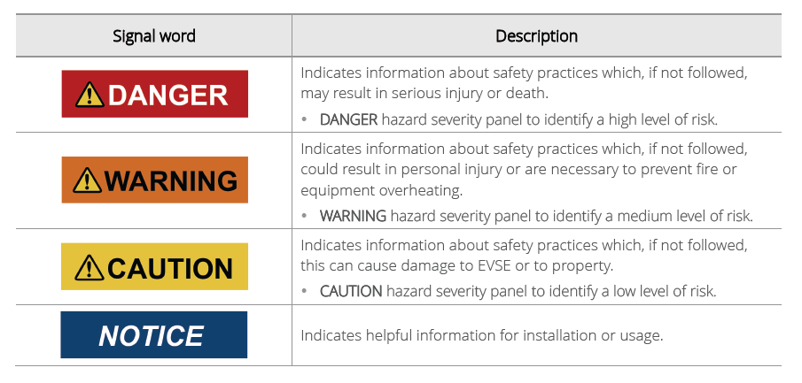

# Select topic

## Add subtopic

You can add subtopics.

1. Select main menu.
2. Select top and sub menu.
3. Check the screen icon and select the desired icon.

***

## Divided topic

You can divided the selected topic.

<figure><figcaption>
<strong>Fig 1. Safety symbols</strong>
</figcaption></figure>
